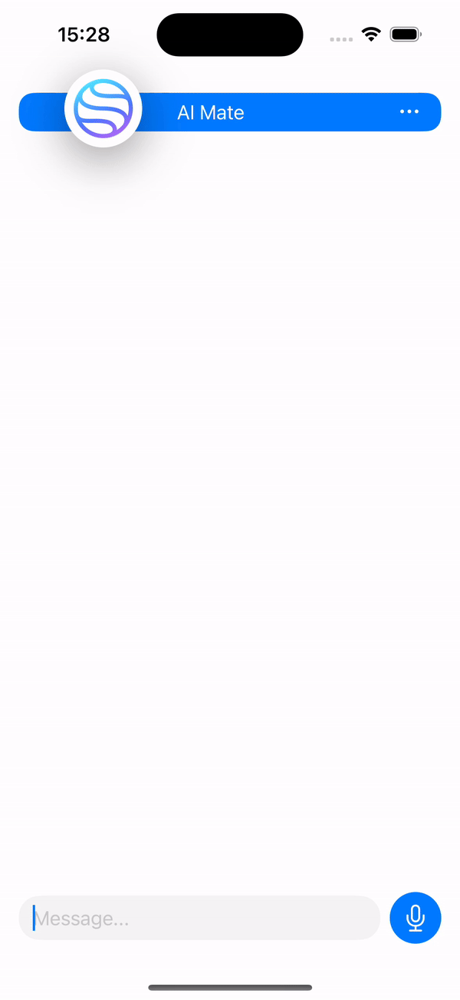

# OpenAI Assistants API V2

A Swift package for integrating OpenAI Assistants API V2, supporting both streaming and standard data transmission. This package allows you to create threads, manage messages, and utilize advanced features like speech-to-text and text-to-speech.




## Getting Started

### Prerequisites

- Swift 5.5 or later
- Xcode 13.0 or later
- An OpenAI API Key, which you can obtain from [OpenAI Platform](http://platform.openai.com).

### Installation

To install the package, add the following dependency to your `Package.swift` file:

```swift
dependencies: [
    .package(url: "https://github.com/iamtheburt/OpenAIAssistantsAPI", from: "0.1.0")
]
```

## Usage

1. **Obtain API Key**

   First, go to [OpenAI Platform](http://platform.openai.com) and obtain your API key.

2. **Initialize AssistantsAPI**

```swift
   let apiKey = "YOUR_API_KEY"
   let assistantsAPI = AssistantsAPI(apiKey: apiKey)
```

3. **Create an Assistant**

To create a new assistant:

1. Visit [OpenAI Assistants](https://platform.openai.com/assistants).
2. Follow the prompts to create a new assistant.
3. Once created, note the **Assistant ID**; you will need this ID to interact with the assistant through the 

4. **Create a New Thread**

```swift
assistantsAPI.createThread { result in
    switch result {
    case .success(let threadResponse):
        let thread = threadResponse.thread
        // Use the thread for further operations
    case .failure(let error):
        print("Failed to create thread: \(error)")
    }
}
```

5. **Add a Message to a Thread**
You can add a message while creating a thread or separately using the createMessage method.

```swift
assistantsAPI.createMessage(
    to: thread,
    role: .user,
    content: [ContentPart(text: "Hello, how can I assist you today?")]
) { result in
    switch result {
    case .success(let message):
        print("Message created: \(message)")
    case .failure(let error):
        print("Failed to create message: \(error)")
    }
}
```

6. **Create a Run (Non-Streaming)**
If you are not using streaming, create a run by specifying the assistant ID:

```swift

assistantsAPI.createRun(
    for: thread,
    assistantId: "ASSISTANT_ID"
) { result in
    switch result {
    case .success(let run):
        print("Run created: \(run)")
    case .failure(let error):
        print("Failed to create run: \(error)")
    }
}
```

7. **Check Run Status**
Periodically check the run status:

```swift
assistantsAPI.getRun(threadID: thread.id, runID: run.id) { result in
    switch result {
    case .success(let run):
        print("Run status: \(run.status)")
    case .failure(let error):
        print("Failed to get run status: \(error)")
    }
}
```

8. **List Messages in a Thread**
Once the run is complete, list all messages in the thread:

```swift
assistantsAPI.listMessages(from: thread) { result in
    switch result {
    case .success(let messages):
        print("Messages: \(messages)")
    case .failure(let error):
        print("Failed to list messages: \(error)")
    }
}
```

9. **Create a Run with Streaming**
For streaming, create a run with the stream parameter set to true and handle partial responses:

```swift
assistantsAPI.createRunStream(
    for: thread,
    assistantId: "ASSISTANT_ID",
    stream: true,
    onPartialResponse: { partialResponse in
        print("Partial response: \(partialResponse)")
    },
    completion: { result in
        switch result {
        case .success(let run):
            print("Run completed: \(run)")
        case .failure(let error):
            print("Failed to complete run: \(error)")
        }
    }
)
```

10. **Speech-to-Text and Text-to-Speech**

Text-to-Speech

```swift
assistantsAPI.createSpeech(
    input: "Hello, how can I assist you?",
    voice: Voice(name: "default")
) { result in
    switch result {
    case .success(let data):
        print("Speech created successfully")
    case .failure(let error):
        print("Failed to create speech: \(error)")
    }
}
```

Speech-to-Text

```swift
assistantsAPI.createTranscription(
    file: audioData
) { result in
    switch result {
    case .success(let transcription):
        print("Transcription: \(transcription.text)")
    case .failure(let error):
        print("Failed to create transcription: \(error)")
    }
}
```

### Contributing

Demo projects and tests will be added soon. I welcome pull requests from the community. Please feel free to contribute!

### License

This project is licensed under the MIT License.

For any issues or questions, feel free to open an issue or reach out.

**Happy coding!**

Ivan Lvov